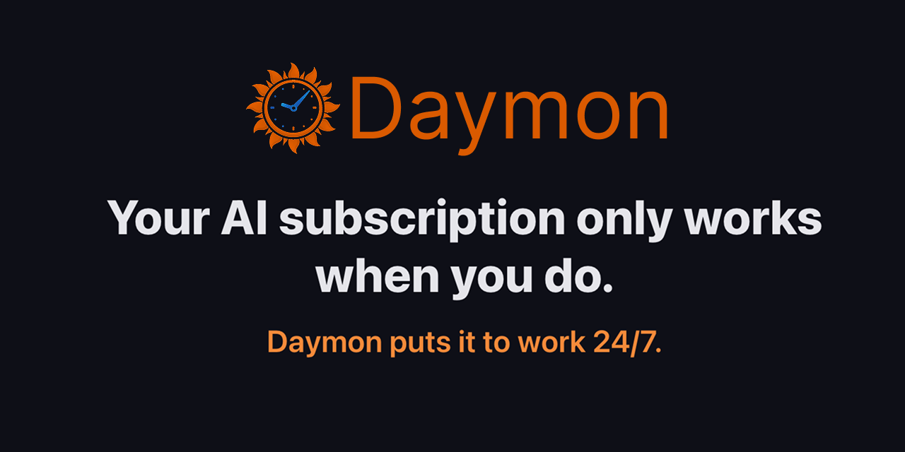
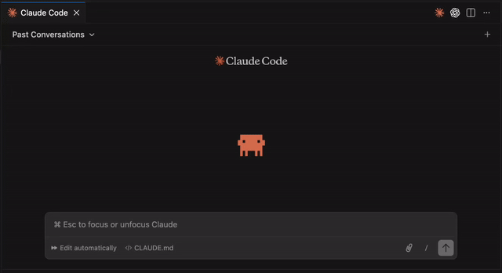

<p align="center">
  <a href="https://daymon.io">
    
  </a>
</p>

# Daymon

[](LICENSE)
[](https://github.com/daymonio/daymon/releases/latest)
[](https://github.com/daymonio/daymon/releases/latest)
[](https://github.com/daymonio/daymon/stargazers)

**Open source autopilot for Claude.**

Scheduled tasks, persistent memory, background automation. No API keys. No cloud. Runs on your Mac.

[daymon.io](https://daymon.io)

<p align="center">
  
</p>

---

## Why Daymon?

You pay for Claude Pro or Max — but it only works when you're actively chatting. The other 23 hours a day, your subscription sits idle.

Daymon changes that. It gives Claude the ability to run tasks on a schedule, remember things across conversations, watch files for changes, and work in the background — all while you sleep, commute, or focus on other things.

No API keys. No token costs. No cloud. Just your existing Claude subscription, working harder.

---

## Requirements

- **macOS 12 (Monterey) or later**, Apple Silicon
- **[Claude Desktop](https://claude.ai/download)** or **[Claude Code](https://docs.anthropic.com/en/docs/claude-code)** (you need at least one)
- A Claude subscription (Pro, Max, or Team) — Daymon uses your existing subscription, no API keys needed

## Installation

### Homebrew (recommended)

```bash
brew install daymonio/daymon/daymon
```

### Download

Download the latest `.dmg` from [GitHub Releases](https://github.com/daymonio/daymon/releases/latest).

### Build from Source

```bash
git clone https://github.com/daymonio/daymon.git
cd daymon
npm install
npm run dev      # Development mode
npm run build    # Production build
```

## Quick Start

### Claude Desktop

Install Daymon and open it. That's it — Daymon auto-configures Claude Desktop on first launch.

Open Claude Desktop and try:

> "Remember that I prefer TypeScript over JavaScript"

> "Every weekday at 9am, check HackerNews for AI news and summarize the top 5 stories"

> "Watch my Downloads folder and organize new files into subfolders by type"

### Claude Code

Install Daymon and open it. Daymon auto-configures Claude Code on first launch (if `~/.claude.json` exists).

Then try:

> "Remember this project uses PostgreSQL 16 and runs on port 5432"

> "Schedule a daily code review of this repo every morning at 8am"

## What is Daymon?

Daymon is a macOS app that lives in your menu bar and Dock. It gives Claude persistent memory, scheduled tasks, workers, and file watchers — all running locally on your machine.

Your Claude subscription only works when you do. Daymon puts it to work 24/7.

## Features

**Scheduled Tasks** — "Every weekday at 9am, check HackerNews for AI news." Just tell Claude what you want. Daymon handles the scheduling.

**Persistent Memory** — "Remember I'm fundraising Series A." Say it once, it sticks forever. Knowledge graph with semantic search, no API keys.

**Workers** — Named agent personalities with system prompts. Assign a Researcher, Chief of Staff, or Code Reviewer to any task. 9 templates included.

**Self-Improving Tasks** — Tasks get smarter every time they run. Daymon learns what works and skips the guesswork on future runs — faster results, no configuration needed.

**Session Continuity** — Tasks resume where they left off. "Compare today's results to yesterday's" just works.

**File Watchers** — "When a new file appears in Downloads, organize it." Daymon watches folders and acts automatically.

**100% Local** — No cloud. No account. Your data is a SQLite file you can inspect anytime.

## Workers

Workers are named agent profiles with system prompts. Each worker defines a personality, values, and anti-patterns that shape how tasks execute.

| Template | Description |
|----------|-------------|
| Chief of Staff | Proactive business ops — triages, anticipates needs, proposes actions |
| Researcher | Deep research with strong opinions — synthesis over summarization |
| Code Reviewer | Catches what linters miss — leads with blockers, no bikeshedding |
| Writer | Sharp writing — cuts fluff, clarity over everything |
| Email Assistant | 3-tier triage, drafts replies, never sends |
| Tech Trend Analyst | Tech-only trends + tweet drafts with real takes |
| Competitor Tracker | Reports signal, not noise — silence is a valid report |
| DevOps | Reliability over novelty — boring infrastructure that works |
| Data Analyst | Analysis that drives decisions, not dashboards |

Create workers in the Daymon UI or via Claude: "Create a worker called 'My Analyst' with this system prompt..."

## All Tools

<details>
<summary>Full tool reference (click to expand)</summary>

### Memory

| Tool | Description |
|------|-------------|
| `daymon_remember` | Store a fact, preference, or project detail |
| `daymon_recall` | Search memories by keyword |
| `daymon_forget` | Delete a memory |
| `daymon_memory_list` | List all stored memories |

### Scheduler

| Tool | Description |
|------|-------------|
| `daymon_schedule` | Create a task (recurring, one-time, or on-demand) |
| `daymon_list_tasks` | Show all tasks |
| `daymon_run_task` | Manually trigger a task |
| `daymon_pause_task` | Pause a task |
| `daymon_resume_task` | Resume a paused task |
| `daymon_delete_task` | Delete a task |
| `daymon_task_history` | Show past runs |
| `daymon_task_progress` | Check running task progress |
| `daymon_reset_session` | Clear session for a task |

### Workers

| Tool | Description |
|------|-------------|
| `daymon_create_worker` | Create a worker with name and system prompt |
| `daymon_list_workers` | List all workers |
| `daymon_update_worker` | Update a worker |
| `daymon_delete_worker` | Delete a worker |

### File Watching

| Tool | Description |
|------|-------------|
| `daymon_watch` | Watch a folder for changes |
| `daymon_unwatch` | Stop watching |
| `daymon_list_watches` | List active watches |

</details>

## Development

```bash
npm run dev          # Start dev mode
npm run build        # Full build (main + renderer + MCP)
npm test             # Run test suite
npm run typecheck    # TypeScript type checking
npm run build:mac    # Build + package macOS DMG
```

<details>
<summary>Project structure</summary>

```
daymon/
├── src/
│   ├── main/           # Main process
│   │   ├── scheduler/  # node-cron task scheduling
│   │   └── db/         # SQLite database layer
│   ├── mcp/            # MCP server (stdio)
│   │   └── tools/      # Memory, scheduler, watcher tools
│   ├── renderer/       # React + Tailwind UI
│   └── shared/         # Types, schema, constants
├── docs/               # Landing page (daymon.io)
└── resources/          # App icons
```

**Tech stack**: React 18, Tailwind CSS 4, TypeScript, Vite 7, better-sqlite3, node-cron, chokidar, zod, MCP SDK, HuggingFace Transformers (local embeddings), Vitest

</details>

## License

MIT License. See [LICENSE](LICENSE) for details.
